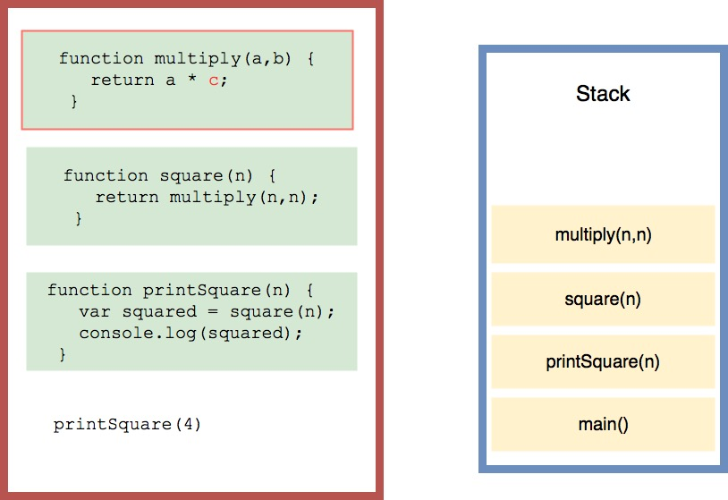
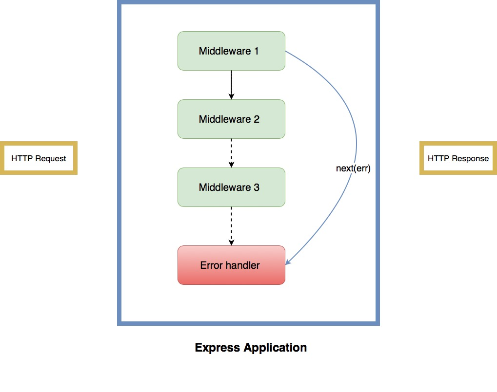

# Error Handling Patterns in Express.js


Building an application isn't just about writing code that works. It's about making your program run flawlessly, so it behaves well when you encounter unexpected conditions. There are at large two types of errors in JavaScript: programmer errors and real-time errors. The programmer errors are fixable during development, while real-time, operational errors are not predictable. You need an efficient error handling mechanism that keeps your Node server stable regardless of its type.

The objective of this tutorial is to teach you different ways that you can handle JavaScript errors for your Express server. 

## Preqrequisites

You need to set up an Express server to get started. Assuming that you've already installed Node.js and npm, create a working directory for your application. 

```bash
mkdir demo-app
cd demo-app
```

Use the `npm install` script to generate a *package.json* file. I prefer to set the entry point of the application to *app.js*. Next, install express and other related packages and save these dependencies into your *package.json*.

```bash
npm install express --save
npm install -g nodemon
```
I've installed nodemon which is an essential development tool for a Node.js application. nodemon will watch all the files in the demo-app directory and if any changes are detected, nodemon will automatically restart your application. If *app.js* is the entry file, you can run `nodemon node app.js` and nodemon will take it from there. 

Here is a very basic middleware to test that everything's in place:

```
//app.js
const express = require('express')
const app = express()

app.get('/', (req, res) => res.json(
    {
        status: 200,
        message: "Server is up and running"
    })

app.listen(3000, () => console.log('Listening to port 3000!'))
```

## A bit of theory first

Let's have a look at what happens under the hood when you run your application. When an error is encountered in JavaScript, the interpreter stops whatever it's doing and then throws an exception. The throw here refers to JavaScript's throw mechanism. The execution of the current function stops and the interpreter starts looking for a catch block so that the application doesn't terminate. However, when it doesn't find one, it jumps out of the current function and all the other functions on top of it in the call stack until an exception handler is found. When it reaches the top-level function that started the execution, it terminates the program because no exception handling mechanism was found. That's when Node returns an error screen in the console.

Here's a simple demonstration of how JavaScript creates a call stack. 

As you can see, the current function that's being executed will be at the top of the stack. Imagine that we're throwing an error inside `multiply(x,y)` because the input fails some validation condition. This scenario is exemplified below:

The interpreter jumps out of all the functions in the stack until it finds a catch block. That's where you can place the logic to handle your errors. Otherwise, the program gets terminated.

Crashing an application with every error would be disastrous. Instead, we need more reliable and novel techniques to handle exceptions and then let the user know that an error has occurred. Standard JavaScript errors and system errors throw an error object which is an instance of the Error class. The error object has information about the type of error, a message and a stack trace that can help you debug your application during development.

## How to handle errors in Express.js

### Express Middlewares

An Express application is essentially a series of middleware function calls that get invoked after the server receives a request and before a response is generated. Each middleware function has access to the request object, the response object, and the next function in the request-response cycle. The next function takes the control to the next middleware that succeeds the current middleware.



Express.js has a built-in error handling middleware that can be used to report any errors.  The error handling middleware should be placed towards the end of your app.js file - after all the `app.use` calls so that it's the last middleware to be invoked in the request-response cycle. Unlike an ordinary middleware function, error middleware has four arguments instead of three: `(err, req, res, next)`.

```
app.use( (err,req,res,next) => {
    res.status(500)
     .json({
          name: err.name, 
        message: err.message, 
        trace: err.stack
     })
});
```
In the above code, we've created a middleware that returns a status code of 500 and then provides detailed information about what went wrong. You can verify that it works by triggering an error like this:

```
const express = require('express')
const app = express()

app.get('/', (req, res) => {
    res.json({
        status: 200,
        message: success //success is not defined
    })
})

app.use( (err,req,res,next) => {
    res.status(500)
       .json({
           name: err.name, 
           message: err.message, 
           trace: err.stack
       })
});
app.listen(3001, () => console.log('Listening to port 3001!'))
```
That should take care of most of the programmer errors during development. For runtime errors, you can use the throw keyword to intentionally throw exception when something unexpected happens.

```
app.get('/forbidden', function(req, res, next) {
  let err = new Error(`${req.ip} tried to access /Forbidden`); 
  err.statusCode = 403;
  next(err);
});
```

The biggest benefit of middlewares is that they can be organized further. For instance, you can create an additional middleware that logs all the errors and then chain it with the error handling middleware. Apart from that, middlewares are also a great place for generalized error handling. In the example below, we're using the wildcard '\*' to catch requests to undefined routes and then throw an error.
```
app.use('*', function(req, res, next) {
  let err = new Error(`${req.ip} tried to reach ${req.originalUrl}`); 
  // Create a new error with relevant information
  err.statusCode = 404;
  err.redirect = '/home' 
  next(err);
});

app.use(logErrors); // Use this middleware to log errors
app.use(errorHandler); //The error handler middleware that we created earlier.
```

### What about asynchronous JavaScript errors?
Throwing an exception and handling it in the same tick isn't hard. However, a lot of things in JavaScript happen asynchronously, and the above technique wouldn't work. There are many asynchronous ways to handle the errors. 

One popular method was to use an error-first callback method where a callback function is provided as an argument. When that asynchronous operation is completed, the callback function either returns an Error object as the first argument (when an error is thrown) or null. 

Here's an example of handling asynchronous errors using error-first callback method.
```
app.get('/users/:id', (req, res, next) => {
  const userId = req.params.id
  if (!userId) {
    const error = new Error('missing id')
    error.httpStatusCode = 400
    return next(error)
  }

  Users.get(userId, (err, user) => {
    if (err) {
      err.httpStatusCode = 500
      return next(err)
    }

    res.send(users)
  })
})
```
However, the problem starts to show up when you have lots of asynchronous calls, one inside another, resulting in something known as callback hell and a lot of boilerplate code.
If you're into promises, you can do something like this:

```
app.get('/users', function (req, res, next) {
  // do some sync stuff
  
   Users.get(userId)
    .then(function (data) {
      // handle data
      return buildProfile(data)
    })
    .then(function (profile) {
      // do something here
    })
    .catch(err => {
        err.httpStatusCode = 500,
        next(err);
     })
})
```
When the promise is rejected, the errors are caught in the catch block, and we're using next(err) to let the error handler take care of it. This looks nice, but when we have a chain of then's, we'll end up with one critical error handler for the whole chain. To get actual control of the errors that are thrown, you could settle for a pattern like this:

```
Promise.resolve()
.then(Function1).catch(errorHandler1)
.then(Function2).catch(errorHandler2)
.then(Function3).catch(errorHandler3)
.then(Function4).catch(errorHandler4)
.catch(finalErrorHandler);
```
There are many other patterns out there to handle errors better, but it still appears verbose, and Promises don't appear to be the right fit for the job. That's why async/await was introduced into JavaScript. The purpose of async/await is to simplify the behavior of promises and make the code appear synchronous.

Here's an excerpt from [Mozilla Web Docs](https://developer.mozilla.org/en-US/docs/Web/JavaScript/Reference/Statements/async_function) that explain how async/await works:

> An async function can contain an await expression that pauses the execution of the async function and waits for the passed Promise's resolution, and then resumes the async function's execution and returns the resolved value.

> Remember, the await keyword is only valid inside async functions. If you use it outside of an async function's body, you will get a SyntaxError.

Implementing async/await is straightforward, and you can then handle the errors using a try/catch block as follows:

```
app.get('/users', async (req, res, next) => {
  try {
    const user = await Users.get(userId)
    res.json(user);
  } catch (e) {
    //Use next(e) so that the error handler kicks in
    next(e) 
  }
})
```

The callback function has an `async` keyword attached to it, and the asynchronous calls appear synchronous because of `await Users.get()`. We use the traditional try/catch to catch the errors and then pass the control to the error handler middleware using next. 

We're close, but this isn't perfect! We need to use a try/catch block on each middleware, and that's a lot of boilerplate that you can avoid! Instead, we can create a helper function that wraps all the routes and handles rejected promises.

```
const wrapperMiddleware = fn =>
  (req, res, next) => {
    Promise.resolve(fn(req, res, next))
      .catch(err => {
      err.httpStatus = 500,
      next(err)
      });
  };
```
  
WrapperMiddleware accepts a function as an argument so we resolve the function inside our wrapper. We pass the function to `Promise.resolve` and it resolves to whatever value returned by the route handler. If an error occurs and the wrapper receives a rejected promise, the catch block will be invoked. 

```
router.get('/users', wrapperMiddleware(async (req, res, next) => {
    
    const user = await Users.get(userId)
    res.json(user);
    
    // The wrapperMiddleware's catch block will catch any errors and then 
    // pass it onto the error handler
}));

```

In my opinion, this is the best method to handle asynchronous errors in Express, and it looks cleaner than Promises.
