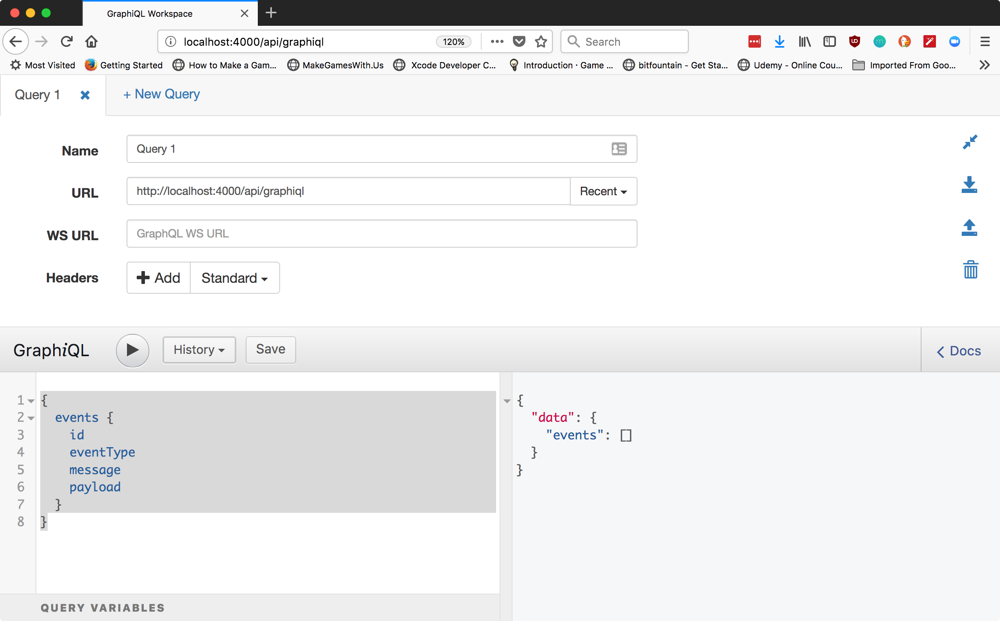

# A Gentle Introduction to Using GraphQL with Elixir and Phoenix

## Part 1: Getting a working GraphQL application!

Last Updated: _June 18, 2018_

## Preface: How to get started with this guide

### Latest Versions

- Elixir: v1.6.5
- Hex: v0.17.7
- Phoenix: v1.3.2
- Ecto: v2.2.10 (phoenix_ecto version is v3.2)
- Absinthe: v1.4
- Absinthe Plug: v1.4

This tutorial was built on a Mac OS X 10.11.6 system.

### Assumptions

1.  You understand a minimum of Elixir syntax and concepts
2.  You already have a development database ready to go
3.  You have all of the pre-requisite software installed. Pre-reqs are:
    - Postgresql with an appropriate development username/password ([Installation Guide](https://wiki.postgresql.org/wiki/Detailed_installation_guides))
    - Elixir ([Installation Guide](https://elixir-lang.org/install.html))
    - Phoenix ([Installation Guide](https://hexdocs.pm/phoenix/installation.html#content))
    - A code editor or IDE (I'll be using [Visual Studio Code](https://code.visualstudio.com/Download))

### About this guide

Throughout this guide, you'll see a lot of useful stuff, whether it's descriptions, code, or shell commands! Any time you see some code like this:

    $ do the thing

These blocks represents shell commands being run (specifically, anything with a `$` in front of it). Any additional lines will be output from the command run. Sometimes `...` will be used to indicate long blocks of text cut out in interest of brevity.

IEx (Elixir's Interactive REPL) has commands will be represented like this:

    iex(1)> "do the thing"

And any additional lines will be output from that operation. Don't worry about the number inside of the parantheses. These just indicate what command number your IEx shell is currently on and these may not match up.

Code will be represented in code blocks, like this:

```
name = "brandon"
name
|> String.upcase()
|> String.reverse()
```

The best way to get the most out of this tutorial is to follow along as you build the same project as us (or something equivalent). The code will be available on Github with checkpoint tags at each step allowing you to double-check your code against the finished product per each checkpoint!

## Moving on to the application

We'll start off by actually talking about what problem this project is designed to solve. It's always good to think about what you're building before you start thinking about what you're building with; it prevents some chicken-and-egg scenarios where you have a great technology that you're using and the project you're trying to build with it is totally incompatible.

The project we're building is going to be an application that will store/retrieve Event Logs. You could use this for something like tracking requests you're making, or tracking audit events in a log, or...well, anything that would require storing some arbitrary events with types, messages, and payloads. We'll start off by actually creating our project and getting everything set up before we start talking more about the design.

Next, our tech choice: Elixir and Phoenix are absolutely fantastic for building extremely high performance, low maintenance systems, and GraphQL's ability to fetch huge sets of data in varied ways makes Elixir a particularly great symbiotic fit!

Our project will be called "Greenfy" short for "Green Faerie" (yes, a silly Absinthe reference), but slightly more startup-sounding.

### Creating a new project

This is what happened:

    $ mix phx.new greenfy
    Fetch and install dependencies? [Yn] y
    ...
    We are all set! Go into your application by running:

    $ cd greenfy

    Then configure your database in config/dev.exs and run:

    $ mix ecto.create

    Start your Phoenix app with:

    $ mix phx.server

    You can also run your app inside IEx (Interactive Elixir) as:

    $ iex -S mix phx.server

Run our tests, verify green.

### Setting up our app

Next, we'll want to follow the instructions given to us by Phoenix upon creating a new project, so we'll need to do the following:

    $ cd greenfy
    $ mix ecto.create
    The database for Greenfy.Repo has been created

You should already have your database set up with a user account that can create and modify databases as necessary, so when you run the `mix ecto.create` command, Ecto will helpfully create the development database for us to run our migrations on later!

### Adding in Absinthe

We know we're going to be building a GraphQL project, so we're going to add Absinthe nice and early in the process. We'll need to add both libraries for `absinthe` and `absinthe_plug` (we'll need `absinthe_plug` since we're using Phoenix to build out our application).

Open up `mix.exs` and add the following line to the `defp deps do` function block:

    {:absinthe, "~> 1.4"},
    {:absinthe_plug, "~> 1.4"}

Make sure you add a comma at the end of what was previously the last line in that list of tuples or you'll get a syntax error! At the top, in the block for the `application` function, you'll want to add in support for Absinthe Plug via adding one more atom into the extra_applications list, `:absinthe_plug`. The resulting function body should look like this:

```
  def application do
    [
      mod: {Greenfy.Application, []},
      extra_applications: [:logger, :runtime_tools, :absinthe_plug]
    ]
  end
```

Then run:

    $ mix do deps.get, compile
    ...
    Generated greenfy app

You may be wondering why we're adding both `absinthe` and `absinthe_plug`. The reason for this is that first of all, the `absinthe` dependency handles _most_ of the scenarios we need handled for a smooth integration between GraphQL and Elixir,

### Creating our first GraphQL query

So, you're probably coming into this tutorial already having an inkling of what GraphQL is and what it does and what it provides for both the developer and the end-user. A pitfall I've run into repeatedly over the course of my career is that most REST APIs over time become less RESTful. There are more and more exceptions you need to build into your application, and some of your endpoints become too bloated and they're difficult to modify out or...

Well, lots of things happen. Especially if you have a mobile or client application that is reliant on your data! The shape of what you might fetch for a desktop client is likely going to look radically different from what you would fetch for a mobile client, especially on a slower connection.

GraphQL recognizes two things:

1.  The shape of your data will change
2.  The shape of your data needs to be different for each client

Based on that, GraphQL implements more of a client-focused method of getting data out of a system. The client will tell the server what data it needs, and more importantly, HOW it needs that data to be shaped! This allows you to iterate a little faster, to build better filters and functionality, and easily add support for more data in your system without having to build/version a whole brand new endpoint that you will also need to support over time.

Another awesome feature is that GraphQL supports querying for schema information, which means your users can do more to figure out the shape of the data and what they can do with it, which is incredibly helpful for both the client AND the server!

GraphQL is not perfect, by any means. It's pretty complicated and you'll likely run into a lot of people with lots of REST experience not understanding why a particular piece of a GraphQL query works the way it does. You'll need to train your users to be able to use this new API effectively, but the end result is allowing the client to get whatever they want, however they want it!

With that past us, let's move on to talk more about the actual implementation.

#### Designing the shape of our data

Our application is a simple event logging platform, so we're just going to have a very simple table structure (to start).

    events
    ___
    id
    event_type
    message
    payload
    inserted_at
    updated_at

`id`, `inserted_at`, and `updated_at` will all be included as default columns for any Ecto tables we create, so we don't need to worry about how we're going to define those.

For the `event_type`, `payload`, and `message` columns, we're going to use those to track what types of events (unsurprisingly) each event is and message will store a condensed version of the payload. Separately, we have another column called `payload`, whose responsibility is to store the full payload when necessary. This allows the `message` column to stay smaller and easier to search.

#### Getting our database tables running in Ecto

Let's get started by building out this table using Phoenix's built-in generators:

```
$ mix phx.gen.context Log Events events event_type:string message:string payload:text
* creating lib/greenfy/log/events.ex
* creating priv/repo/migrations/20180614191428_create_events.exs
* creating lib/greenfy/log/log.ex
* injecting lib/greenfy/log/log.ex
* creating test/greenfy/log/log_test.exs
* injecting test/greenfy/log/log_test.exs

Remember to update your repository by running migrations:

    $ mix ecto.migrate
```

Next, let's run the migrate command:

```
$ mix ecto.migrate
[info] == Running Greenfy.Repo.Migrations.CreateEvents.change/0 forward
[info] create table events
[info] == Migrated in 0.0s
```

This is actually enough for us to start building out the GraphQL portion of our application!

#### Building support for our first query in GraphQL

Let's take a look at what a sample query for our `Log.Events` schema might look like:

```
{
    events {
        id
        event_type
        message
        payload
        inserted_at
        updated_at
    }
}
```

To make this work, we'll need to define both the Types and the Schemas for GraphQL to understand how to turn data in the database, and then data in Elixir data structures, into GraphQL data structures. We'll start off by defining the types. Create a new file, under `lib/greenfy_web/schema`, called `data_types.ex` (you'll need to create the `schema` directory), and we'll start defining our first object type:

```
defmodule Greenfy.Schema.DataTypes do
  use Absinthe.Schema.Notation

  object :event do
    field :id, :id
    field :event_type, :string
    field :message, :string
    field :payload, :string
  end
end
```

You'll probably notice that `:inserted_at` and `:updated_at` are not being included in our data types notation yet! The reason for this is that those are not easily represented by the standard built-in types for Absinthe, so we'll need to define some fancy `scalar` types later! (Don't worry, we'll describe this all in great detail later!)

#### Sidebar: GraphQL Definitions

We're using A LOT of terms here pretty liberally when talking about GraphQL but not doing a lot to explain what they actually are, so let's take a really quick sidebar talking about some of the terms we've discussed so far (and the ones we'll be doing later).

First off, we have **Types**. Types are exactly what they sound like: definitions of the various data types we'll be defining for our GraphQL application. A good example of this is the object definition above: An **event** is a GraphQL **object** type, with four **fields** defined on it so far (we'll get to fields next).

A **Field** is essentially a bit of queryable information. An object, like the data type we defined previously, stores a collection of different fields together. Each field should define, at a minimum, its name (or key) and its type.

Next, we'll be working with **Schemas**. If **Types** define what data is queryable in our GraphQL API and the shape of that data, the **Schema** defines how we actually get that data OUT of our GraphQL API.

Later on, you'll see something called **Resolvers**. If the **Schema** tells the client how to query the data out of our application, the **Resolver** tells the server how to react to that query and how to interpret those GraphQL queries.

Finally, this will be something we'll use much later, but you'll hear it mentioned before that point: **Mutations**! Mutations are how the data in our GraphQL application is modified! Instead of your `POST`, `PUT`, and `PATCH` endpoints in your REST API, you just define **Mutations** instead.

#### Back to our implementation

Next, we'll need to create our `Schema`. Create `lib/greenfy_web/schema.ex` and give it the following contents:

```
defmodule Greenfy.Schema do
  use Absinthe.Schema

  import_types Greenfy.Schema.DataTypes

  query do
    @desc "Get a list of events"
    field :events, list_of(:event) do
      resolve fn _parent, _args, _resolution ->
        {:ok, Greenfy.Log.list_events()}
      end
    end
  end
end
```

We use the provided `Absinthe.Schema` macro to build out our Schema body. Next, we define our query body, which starts off with a `@desc` statement, which sets a module variable called `desc` (unsurprisingly) which describes the general use for this query. Think of it as a bit of documentation for the client.

Next, in our query, we have a field. Again, our field is queryable data, so we say that our "query" has a key in it called `events`. We're also telling Absinthe that we should expect `events` to return a **list of events**, so we use the function `list_of(:event)` (note the singular version of `event` and that it is an atom, here). This tells Absinthe that when someone queries `events`, we should be fetching a list of the Data Type `Event` that we defined in our Data Types file earlier.

Finally, we have a **Resolver**, which tells Absinthe that when a client queries for a list of events, this function's return statement is what data should be passed back to the client (after some transformation, of course). A `resolve`statement takes in three arguments; the `parent`, the `args` (the arguments to our query, so whatever we might be looking for or filtering on), and the `resolution`, which tells us what to do when we've fetched all of the data and what to do with that data at the end! We'll build on this later by moving our resolvers off into their own code, but for right now we're going to stick with a simple implementation.

#### One final step before we can start testing

Before we get too deep, though, let's modify our router so we can start testing out our application and refactoring as appropriate. Open up `lib/greenfy_web/router.ex`, delete the following block:

```
  scope "/" do
    pipe_through :browser # Use the default browser stack

    get "/", PageController, :index
  end
```

Uncomment out the `/api` scope section, and remove the mention of the Application module, "Greenfy" from the scope block. Then, we'll want to add the GraphiQL route to give us a playground to test out our application. The scope statement should look something like this:

```
  scope "/api" do
    pipe_through :api

    forward "/graphiql", Absinthe.Plug.GraphiQL, schema: Greenfy.Schema
  end
```

### And finally, testing it out

In your terminal, start up your server by running:

```
$ iex mix -S phx.server
```

And then open up your browser window and point it at `http://localhost:4000/api/graphiql`. You should see a window that looks like this:



You can see in this screenshot that we have our initial query running, selecting the primary key, eventType (note the difference from `event_type`; GraphQL expects JavaScript-style Camel-case whereas Elixir by default expects snake_case style. Absinthe handles this conversion for us!) We're not selecting the `inserted_at` and `updated_at` columns yet; we still have time to get to that later!

## Summary

So now we're at a point where we have a base GraphQL API and support for VERY limited operations to get the data out! We understand a bit more about GraphQL, the terminology used, and how it all fits together, so where do we go from here?

Easy: we'll make this application more robust! For one thing, we can't verify this works super well unless we can also get data into it. In addition, testing is already hard, so how on earth are we going to test something so completely malleable?

Stay tuned! We have a lot more to talk about, a lot more to understand, and hopefully we can eventually land at being experts at implementing GraphQL APIs in Elixir.

Following along? You can check your work against the tutorial repo at [Github](https://github.com/richeyb/greenfy-example). Tag/Release v0.1.0 is the complete version for this phase of the tutorial.
