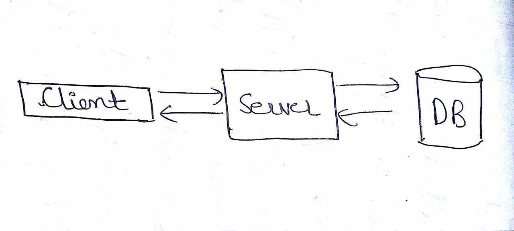
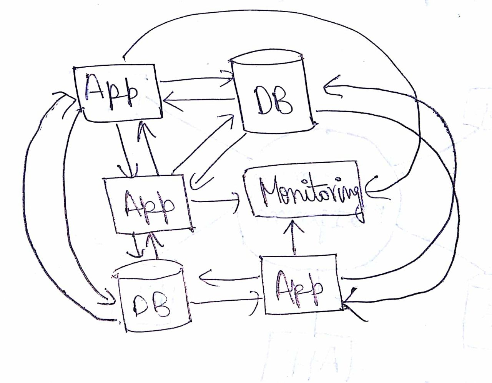
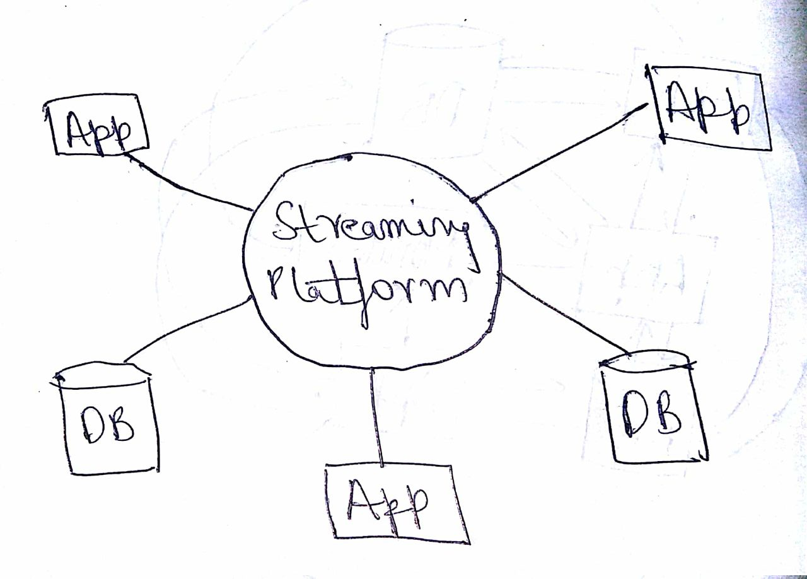

# Hello world in Kafka using Python

Howdy! Welcome to blog series by [Timber.io](https://timber.io) on various tools and technologies.

This blog is for you if you've,

- Ever marvelled what is Kafka? 
- Heard of streaming/queueing/messaging systems but wondering why should one use it? 
- What are the true benefits of using them?
- How would it fit with your current backend architecture? 
- You might just be eager to get started with using Kafka! 

<Illustration>

_Just a disclaimer: we're a logging company here @ Timber. We'd love it if you tried out our product (it's seriously great!), but that's all we're going to advertise our product ... you guys came here to learn about Kafka and this guide won't disappoint._

## What is this blog about ? 
You might have got a hint of it already. This blog is about understanding what is Kafka, apprehending the need for a tool like Kafka and then getting started with it using Python. We're believers that the best way to learn something is to do it, so get out your terminal and your favorite code editor and get ready. 

---
## What is Kafka? Why should one use it?
In short, Kafka is a distributed streaming platform.

> Oh wait! What does that even mean?

Imagine that you have a simple web application which consists of an interative UI, a web server and a database. 



You need to record all the events such as clicks, requests, impressions and searches that take place on your web application and store them for computation, reporting and analysis, each of which is done by separate applications or services. A simple solution would be to store the data in your database and connect all other applications and services to your database.



This might look simple, but you're not finished. There are multiple challenges that can arise. 

1. Events like clicks, requests, impressions and searches results in high frequency interaction/requests or data flow to your webserver and your primary database may not be equipped to scale seamlessly. This could introduce high latencies as more and more events pour in to the server.
2. If you go ahead and store high frequency data in database systems like SQL or Mongo, it would be hard to introduce and reconstruct a new system or a database on all of the historical data. You lose the flexibility to extend the capabilities of your system by introducing new techologies.
3. What if you have data processing systems in place to process these events to gain deeper insights? Since these systems wouldn't be capable of handling high frequency reads and you wouldn't have access to the true source of data it is practically impossible to experiment with various data processing, machine learning algorithms on all of the data.
3. Each application can follow their own data formats, which means that you will need systems for data transformations when there is exchange of data across these applications.

All these problems can be better addressed by bringing a streaming platform like Kafka into the picture. A streaming platform is a system that can perform the following:

1. Store huge amount of data that can be persistent, checksummed and replicated for fault tolerance 
2. Process continuous flow of data (data streams) in real time across systems
3. Allow applications to publish data or data streams independently and agnostic to the application / service consuming it

> Interesting! How different or similar is it from traditional databases?

Although Kafka can store persistent data, it is NOT a database.

Kafka not only allows applications to push or pull continuous flow of data, but also deals with processing them to build and support real time applications. This is different than performing CRUD operations on passive data or running queries on traditional databases. 

> That sounds convincing! But how does Kafka solve the above mentioned challenges and why would one need a system like this?

Kafka is a distributed platform and built for scale, which means it can handle sky-high frequency reads and writes & store huge volumes of data. It ensures that the data is always reliable. It also supports strong mechanisms for recovery from failures. Here are some of key aspects on why one should be using Kafka:

### 1. Simplify the backend architecture

Look at how a complex architecture can be simplified and streamlined with the help of Kafka



### 2. Universal pipeline of data

As you can see above, Kafka acts as a universal data pipeline across multiple applications and services. This gives us two advantages. The first one is data integration. We have all the data from all different systems residing at a single place making Kafka a true source of data. Any application can push data to this platform which can later be pulled by another application. This also gives us our next advantage which is ease in exchanging data across applications. Since, we have all the data at one place, we can standardise the data format that we will be using for the plaform which can reduce our data transformations.

### 3. Connects to existing systems

Although, Kafka allows you to have a standard data format, it does not mean that applications do not require data transformations. It allows us to reduce the overall number of data transformations in our architecture, but there might be cases when we require transformations. Consider the example of connecting a legacy system to your architecture which does not know about Kafka? In such cases, Kafka offers a framework called Kafka Connect for us to connect to existing systems maintaining the universal data pipeline.

### 4. Process data in real-time

A real time application usually requires continuous flow of data which can be processed immediately or within the current span of time with reduced latency. Kafka Streams makes it possible for us to build, package and deploy such applications without any need for separate stream processors or heavy and expensive infrastructure.

All these features allow Kafka to become the true source of data or a universal pipeline of data for your architecture. This will enable you to easily add new services and applications to your existing infrastructure or even allow you to rebuild existing databases or migrate legacy systems with less time and effort.

# Getting Started with Kafka

## Installation

Installing Kafka is a fairly simple process. Just follow the given steps below:

1. Download the latest 1.1.0 release of [Kafka](https://www.apache.org/dyn/closer.cgi?path=/kafka/1.1.0/kafka_2.11-1.1.0.tgz)
2. Un-tar the download using the following command:
`tar -xzf kafka_2.11-1.1.0.tgz`
3. cd to kafka directory to start working with it:
`cd kafka_2.11-1.1.0`

## Starting the Server

Kafka makes use something called ZooKeeper which is a centralized service for a distributed environment like Kafka. It offers configuration service, synchronisation service, and a naming registry for large distributed systems. You can read more about it [here](https://zookeeper.apache.org/). 

Thus, we need to first start the ZooKeeper server followed by the Kafka server. This can be achieved using the following commands:

```bash
# Start ZooKeeper Server
bin/zookeeper-server-start.sh config/zookeeper.properties

# Start Kafka Server
bin/kafka-server-start.sh config/server.properties
```

## Understanding Kafka

Here is a quick introduction to some of the core concepts of Kafka architecture:
1. Kafka is run as a cluster on one or more servers
2. Kafka stores streams of records in categories called `topics`. Each record consists of a key, value and a timestamp
3. Kafka works on the publish-subscribe pattern. Thus, it allows some of the applications to act as `producers` and publish the records to Kafka topics. Similarly, it allows some of the applications to act as `consumers` and subscribe to Kafka topics and process the records produced by it
4. Alongside, `Producer API` and `Consumer API`, Kafka also offers `Streams API` for an application to work as a stream processor and `Connector API` through which we can connect Kafka to other existing applications and data systems

## Creating Kafka Topics

Let us start by creating a `sample` kafka topic with a single partition and replica. This can be done using the following command:
```
bin/kafka-topics.sh --create --zookeeper localhost:2181 --replication-factor 1 --partitions 1 --topic sample
```

Now, let us list down all of our Kafka topics to check if we have successfully created our `sample` topic. We can make use of the `list` command here:
```
bin/kafka-topics.sh --list --zookeeper localhost:2181
```

Optionally, you can also make use of the `describe topics` command for more details on a particular Kafka topic. This can be done as follows:
```
bin/kafka-topics.sh --describe --zookeeper localhost:2181 --topic sample
```

## Creating Producer and Consumer

Creating a producer and consumer can be a perfect `Hello, World!` example to learning Kafka but there are multiple ways through which we can achieve it. Some of them are listed below:

1. Command line client provided as default by Kafka
2. [kafka-python](https://github.com/dpkp/kafka-python)
3. [PyKafka](https://github.com/Parsely/pykafka)
4. [confluent-kafka](https://github.com/confluentinc/confluent-kafka-python)

While each of them have their own set of advantages and disadvantages, we will be making use of `kafka-python` in this blog to achieve a simple producer and consumer setup in kafka using python.

# Kafka with Python

Before you get started with the following examples, ensure that you have `kafka-python` installed in your system:

```
pip install kafka-python
```

## Kafka Consumer

Enter the following code snippet in an interactive python shell:

```
from kafka import KafkaConsumer
consumer = KafkaConsumer('sample')
for message in consumer:
    print (message)
```

## Kafka Producer

Now that we have a consumer listening to us, let us create a producer which generates messages that are published to Kafka and thereby consumed by our consumer created earlier:

```
from kafka import KafkaProducer
producer = KafkaProducer(bootstrap_servers='localhost:9092')
producer.send('sample', b'Hello, World!')
producer.send('sample', key=b'message-two', value=b'This is Kafka-Python')
```

You can now revisit the consumer shell to check if it has received the records sent from the producer through our kafka setup. 

Thus, a simple `Hello, World! in Kafka using Python`.
