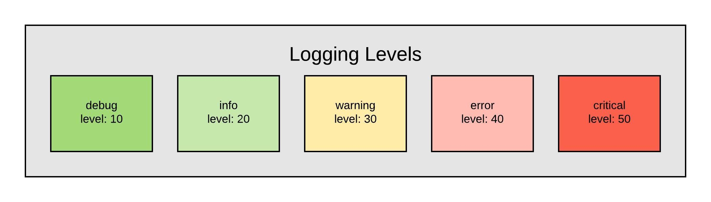
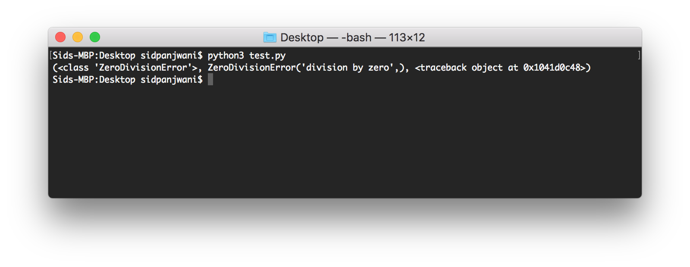
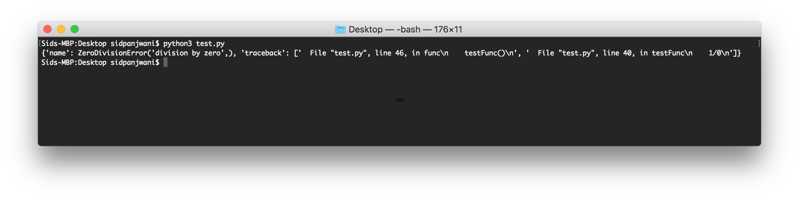
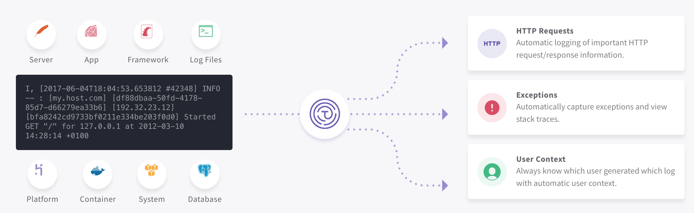

# Logging in Python: Becoming a More Effective Developer
Logging is a development practice we all know we should be doing but is something that is rarely done correctly. I'm known to do this as well -- for me, it's perpetually pushed off until tomorrow. From now, I'm going to hold myself to a higher standard (and I think you should too!).

If you already know the basics, feel free to skip to the bottom. Even if you know your way around the logging module in Python, I’m confident you’ll be able to take something away from this post.

_Just a disclaimer: we're a logging company here @ Timber. We'd love it if you tried out our product (it's seriously great!), but that's all we're going to advertise our product ... you guys came here to learn about logging in Python, and this guide won't disappoint._

### Why bother?

It seems like it would just be easier to `print` rather than learning the best practices associated with logging.

```python
dogs = ["Retriever", "Labrador", "Bulldog"]
for dog in dogs:
	print(dog)
```

When you're working alone on a small project, you can do this. I wouldn't recommend it because the logging package is easy enough to set up that it still makes sense to follow best practices, but you won't struggle to understand your print statements.

**So why bother with the logging module?**

The logging module automatically adds context, such as line number & timestamps, to your logs. The module makes it easy to add severity levels so you can see what is most relevant to your task. When I first approached the [logging module documentation](https://docs.python.org/3/library/logging.html), I found it hard to understand. Not only will I show you how to log in Python, but also some best practices you can follow to make, so you're not slamming your head against your keyboard in a couple of months.

As Martin Golding said:
> Always code as if the guy who ends up maintaining your code will be a violent psychopath who knows where you live.

Even though I think self-preservation is a good enough reason to start logging (you don’t want the person maintaining your code to come after you), logging can allow you to get your job done quickly and more effectively. Here are a few reasons why:

1. Visibility into User Behavior

When using a cloud-wbased solution such as AWS, it can often feel that you're putting something into a black box when something breaks. It's easy to see what's going in, and you know what you expect should come out, but it's near-impossible to tell what's happening on the inside. Logging can serve as your end-to-end solution to give you visibility into your cloud-based components.

2.  Prevent Problems

If you log effectively, it's possible for you to see issues as they occur, before the user even realizes it. With the power of instant alerts, you can detect and fix a problem without the user reaching out to you.

3. Troubleshooting

At times, things will go wrong with your software. The best you can do is to minimize the number of times this happens. When a user does reach out with an issue, the application logs serve as a source of truth of what the user has done and what has broken.

## Basic Guide

***It's seriously this easy...***

We’re believers that the best way to learn something is to do it, so open up your terminal (yes, I’m serious) and get ready to learn.

Fortunately, logging has been a part of the Python standard library since version 2.3.

```python
import logging
logger = logging.getLogger(__name__)
```

Never seen `__name__` before? You might have seen this with `if __name__ == "__main__":`.  You don't have to use it with the logger, but it allows you to see what file the log is coming from when you read the logs. Basically, `__name__` allows you to see what file you are currently in if the file was imported _OR_ it will return `__main__` if you started your script from that file. [Here](#)(https://www.youtube.com/watch?v=sugvnHA7ElY) is a video that explains it well (and goes by quickly @ 2x speed).

### Logging Levels

Like any good logging module, the one included with the Python library allows you to differentiate between logs of different importance.

Imagine if a log message saying that a server was melting down was buried between thousands of messages of users signing in. You want to store all this information but should react differently to these messages.

There are five levels defined in the module, making it easy to differentiate between messages. Though you don’t have to follow by these guidelines, it makes it easy only to pay attention to the relevant messages.



```python
logger.critical("this better be bad")
logger.warning("more serious problem")
logger.warning("an unexpected event")
logger.info("show user flow through program")
logger.debug("used to track variables when coding")
```

We all know that feeling — getting angry at our program because it’s not acting like we expect and we spam print messages into our program trying to understand what’s going on. The moment we fix the issue, we’re forced to go back and delete those messages. Instead, it’s easy to set the level of the logger to ignore them.

Let’s see what that means:
```python
# should show up
# info is a higher level than debug
logger.setLevel(logging.DEBUG)
logger.info("1")

# shouldn't show up
# info is a lower level than warning
logger.setLevel(logging.WARNING)
logger.info("2")
```

*Sighs Relief.* Now you can write as much as you need to the log while debugging, then change the level of your logger before pushing to production.

You can also [create alerts](https://docs.timber.io/app/alerts/) based upon these messages. You probably don’t need to know every time a user signs in or uploads a picture, but if a volcano goes off next to your data center and things start melting down … it would be pretty nice to get a message on Slack.

### Logging to a File

Generally, you don't (just) want to log to the console for them to be deleted immediately. The logging module makes it easy to write your logs to a local file using a `handler`.

```python
import logging
logger = logging.getLogger(__name__)

handler = logging.FileHandler('myLogs.log')
handler.setLevel(logging.INFO)

logger.addHandler(handler)
logger.info('You can find this written in myLogs.log')
```

## A Less Basic Guide

### Structured Logging: Why you need it

A generic log message provides just about as little information as no log message. Imagine if you had to go through your logs and you saw `purchase completed`. This doesn’t help you answer any questions. *When was the purchase completed? Who completed it? What did they buy?*

This can all be done by formatting your logs.
```python
logFormatter = '%(asctime)s - %(name)s - %(levelname)s - %(message)s'
logging.basicConfig(format=logFormatter)
```

Some of this data, such as `time` and `levelname` can be captured automatically, but if you can (and should) push `extra` context to your logs.

```python
logger = logging.getLogger(__name__)

logger.info('purchase completed', extra={ 'user': 'Sid Panjwani' })
```

If you’re wondering why you do not see your logs, remember to change the `level`. By default, it’s set to `warning`.

*Yes, it’s that’s easy…*

### Tracking Exceptions through Logs

Some companies have made it their core competency helping you capture and react to errors. If you’re just a hobbyist, it’s pretty easy to capture your errors yourself and write them to your logs.

```python
def captureException():
	# this should do something

try:
	1/0
except:
	captureException()
```

When capturing an exception, it’s essential to add context. Similar to when you’re debugging, you want to know who the user is and what they were doing when the exception struck.
```python
import sys

# remember to set up your logger

def captureException():
	logger.warning(sys.exc_info())
```



This gives us a `traceback` object that we can use to see the stack from our exception. We didn’t even need to pass anything into our `captureException` method.

Let’s figure out what the `traceback` object gives us and clean up this information a little.

```python
import sys
import traceback

def captureException():
	r = list(sys.exc_info())

	e = dict()
	e["name"] = r[1]
```



Now, this can be cleaned up using some string manipulation in Python.

***Instead of doing this yourself, we’ve got a pretty awesome service [here @ Timber](timber.io) (it’s seriously great) that automatically captures context with your logs to make debugging easier. Try us out for (completely) free; you don’t even need a credit card!***


