# PromQL for Humans

PromQL is a built in query-language made for Prometheus. Here at Timber [we've found Prometheus to be awesome](https://timber.io/blog/prometheus-the-good-the-bad-and-the-ugly/), but PromQL difficult to wrap our heads around. This is our attempt to change that.

## Basics

### Instant Vectors

_Only Instant Vectors can be graphed._

`http_requests_total`

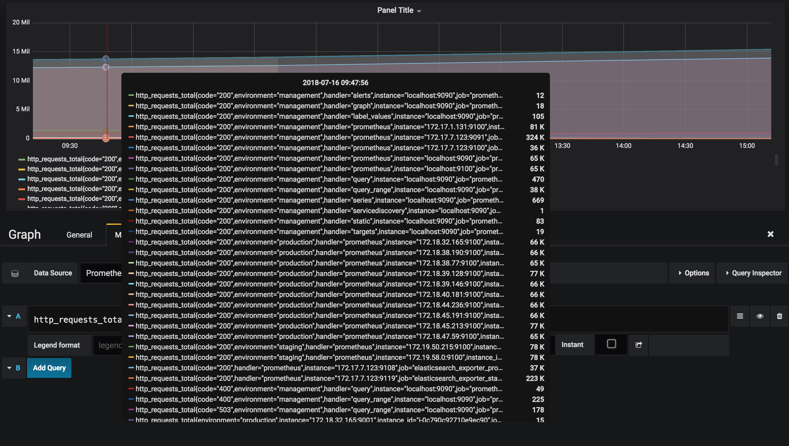

This gives us all the http requests, but we've got 2 issues.
1. There are too many data points to decipher what's going on.
2. You'll notice that `http_requests_total` only goes up, because it's a [counter](https://prometheus.io/docs/concepts/metric_types/#counter). These are common in Prometheus, but not useful to graph.

I'll show you how to approach both.

**It's easy to filter by label.**

`http_requests_total{job="prometheus", code="200"}`

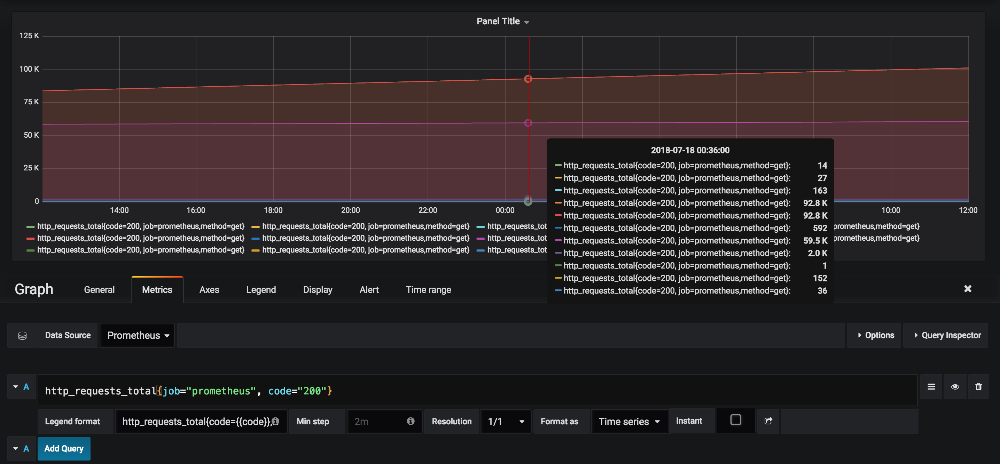

**You can check a substring using regex matching.**

`http_requests_total{status_code=~"2.*"}`

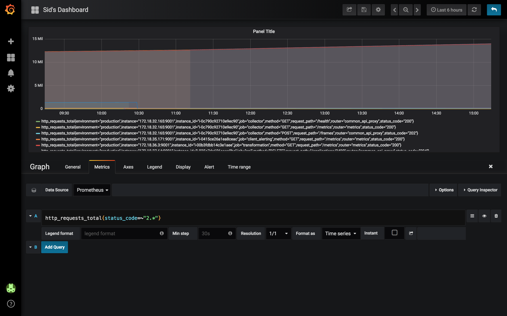

If you're interested in learning more, [here](https://docs.python.org/3/library/re.html) are the docs on Regex.

### Range Vectors

_Contain data going back in time._

Recall: Only Instant Vectors can be graphed. You'll soon be able to see how to visualize Range Vectors using functions.

`http_requests_total[5m]`

You can also use (s, m, h, d, w, y) to represent (seconds, minutes, hours, ...) respectively.

## Important functions

### For Range Vectors

_You'll notice that we're able to graph all these functions. Since only Instant Vectors can be graphed, they take a Range Vector as a parameter and return a Instant Vector._

`rate(http_requests_total[5m])` - increase of `http_requests_total` averaged over the last 5 minutes.

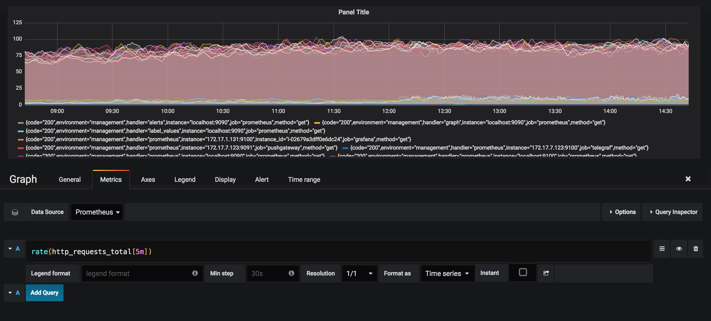

`irate(http_requests_total[5m])` - looks at the 2 most recent samples (up to 5 minutes in the past), rather than averaging like `rate`.

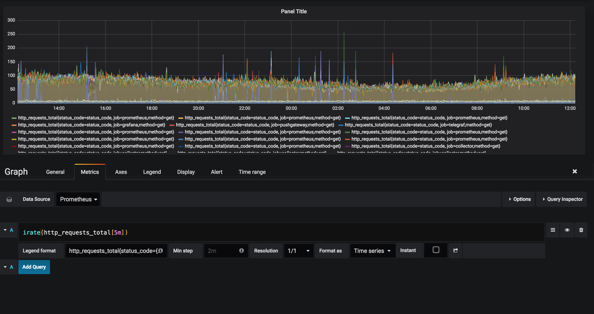

It's best to use `rate` when alerting, because it creates a smooth graph since the data is averaged over a period of time. _Spikey graphs can cause alert overload, fatigue, and bad times for all due to repeatedly triggering thresholds._

`increase(http_requests_total[1h])` - # of http requests in the last hour. This is equal to the `rate` * # of seconds.

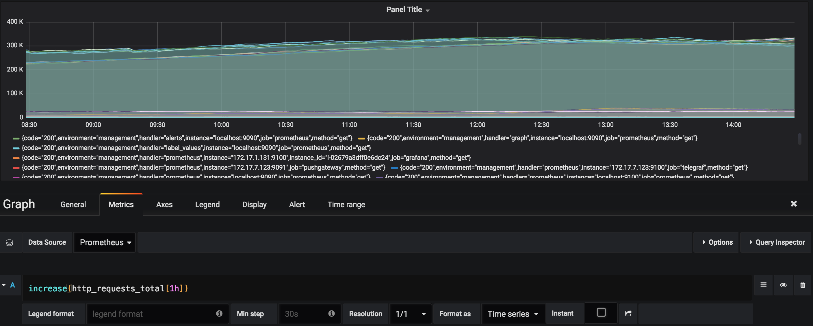

These are a small fraction of the functions, just what we found most popular. You can find the rest [here](https://prometheus.io/docs/prometheus/latest/querying/functions/).

### For Instant Vectors

You'll notice that `rate(http_requests_total[5m])` above provides a large amount of data. You can filter that data using your labels, but you can also look at your system as a whole using `sum` (or do both).

`sum(rate(http_requests_total[5m]))`

You can also use `min`, `max`, `avg`, `count`, and `quantile` similarly.

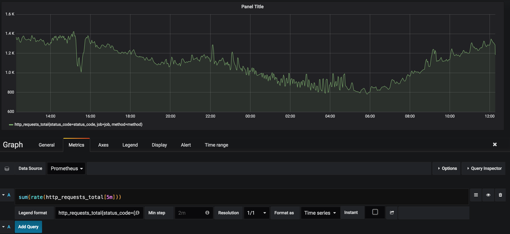

This query tells you how many total HTTP requests there are, but isn't directly useful in deciphering issues in your system. I'll show you some functions that allow you to gain insight into your system.

`sum by(status_code) (rate(http_requests_total[5m]))`

You can also use `without` rather than `by` to sum on everything not passed as a parameter to without.

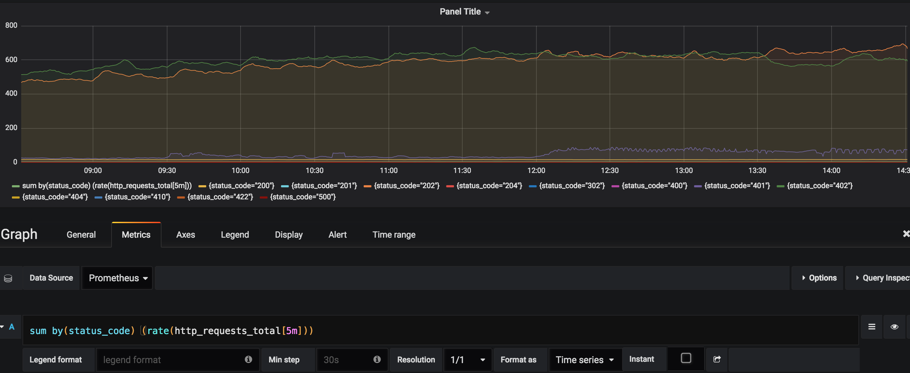

Now, you can see the difference between each status code.

### Offset

You can use `offset` to change the time for Instant and Range Vectors. This can be helpful for comparing current usage to past usage when determining the conditions of an alert.

`sum(rate(http_requests_total[5m] offset 5m))`

Remember to put `offset` directly after the selector.

## Operators

Operators can be used between scalars, vectors, or a mix of the two. Operations between vectors expect to find matching elements for each side (also known as one-to-one matching), unless otherwise specified.

There are Arithmetic (+, -, \*, /, %, ^), Comparison (==, !=, >, <, >=, <=) and Logical (and, or, unless) operators.

### Vector Matching

#### One-to-One

Vectors are equal i.f.f. the labels are equal.

**API 5xxs are 10% of HTTP Requests**

`rate(http_requests_total{status_code=~"5.*"}[5m]) > .1 * rate(http_requests_total[5m])`

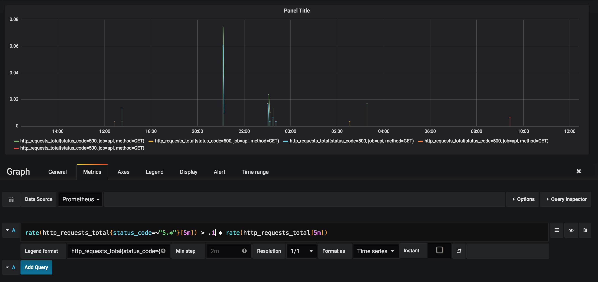

We're looking to graph whenever more than 10% of an instance's HTTP requests are errors. Before comparing rates, PromQL first checks to make sure that the vector's labels are equal.

You can use `on` to compare using certain labels or `ignoring` to compare on all labels except.

#### Many-to-One

It's possible to use comparison and arithmetic operations where an element on one side can be matched with many elements on the other side. _You must explicitly tell Prometheus what to do with the extra dimensions._

You can use `group_left` if the left side has a higher cardinality, else use `group_right`.

## Examples

_Disclaimer_: We've hidden some of the information in the pictures using the `Legend Format` for privacy reasons.

_CPU Usage by Instance_

`100 * (1 - avg by(instance)(irate(node_cpu{mode='idle'}[5m])))`

Average CPU Usage per instance for a 5 minute window.

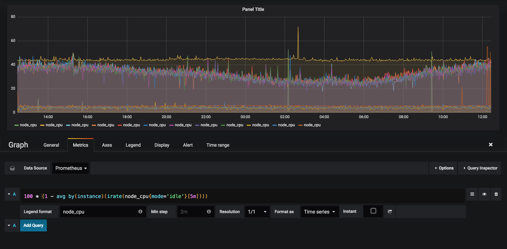

_Memory Usage_

`node_memory_Active / on (instance) node_memory_MemTotal`

Percentage of memory being used by instance.

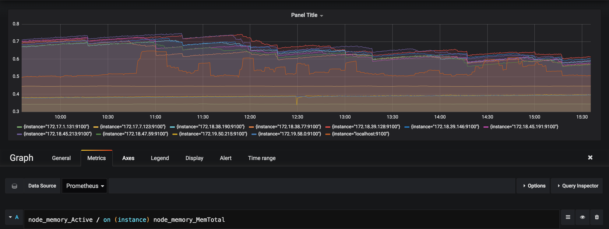

_Disk Space_

`node_filesystem_avail{fstype!~"tmpfs|fuse.lxcfs|squashfs"} / node_filesystem_size{fstype!~"tmpfs|fuse.lxcfs|squashfs"}`

Percentage of disk space being used by instance. We're looking for the available space, ignoring instances that have `tmpfs`, `fuse.lxcfs`, or `squashfs` in their `fstype` and dividing that by their total size.

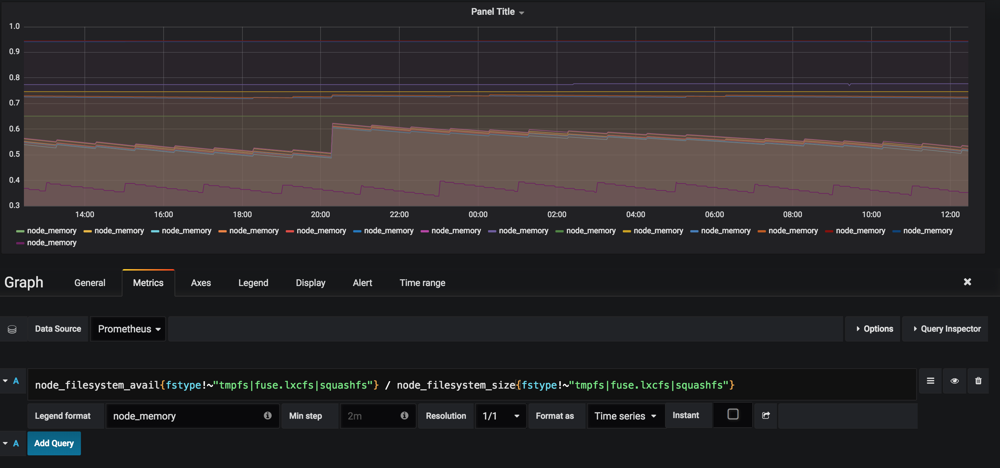

You can find more useful examples [here](https://github.com/infinityworks/prometheus-example-queries).

## 3 Pillars of Observability

It's important to understand where metrics fit in when it comes to observing your application. I recommend you take a look at the [3 pillars of observability](https://peter.bourgon.org/blog/2017/02/21/metrics-tracing-and-logging.html) principle.  Metrics are an important part of your observability stack, but _logs_ and tracing are equally so.

Here at Timber, we're a cloud-based logging company that's looking to make logging easier by seamlessly augmenting logs with context. We've got [a great product](https://timber.io/) built, and you can check it out for free!

