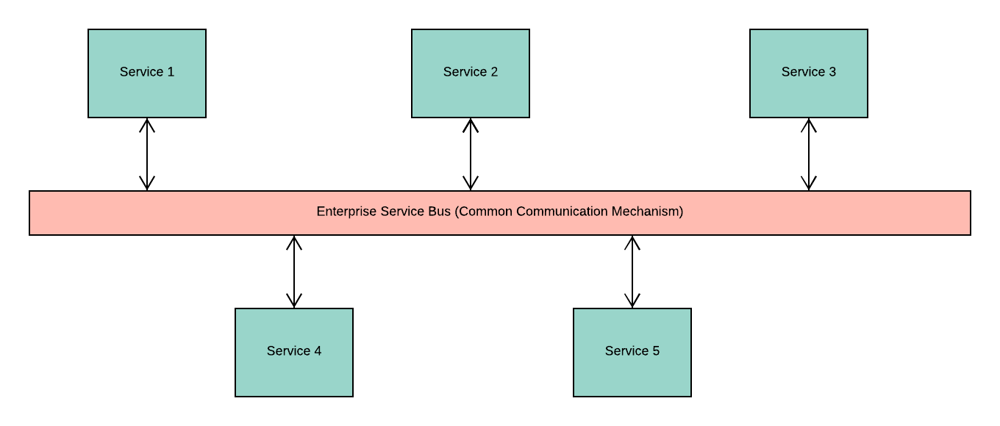
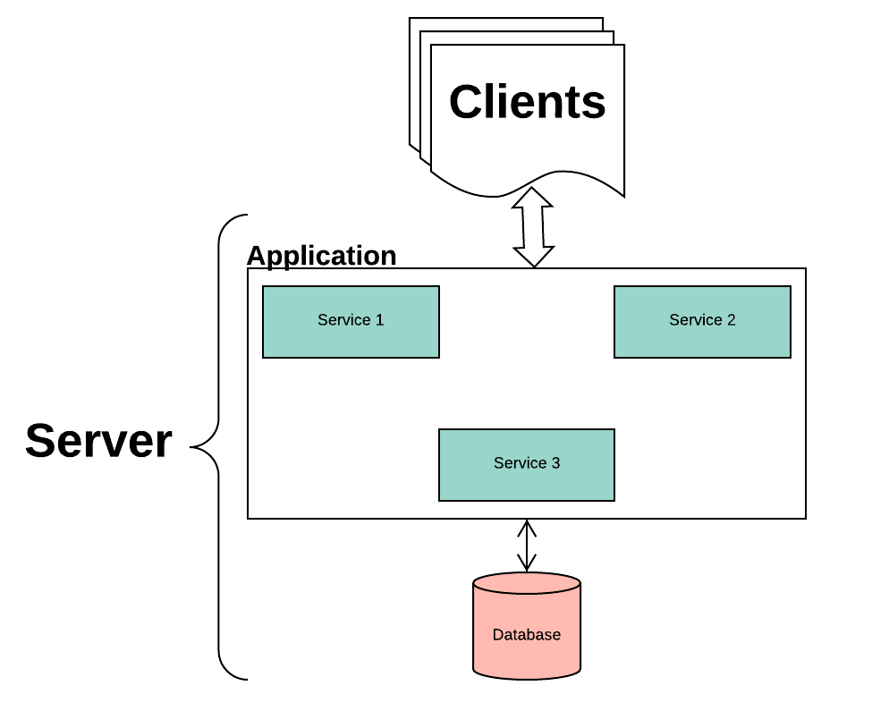
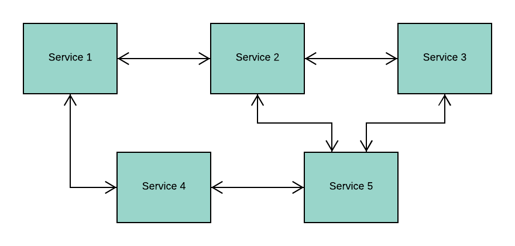

# Rise of Microservices and Docker

Are you a software engineer/developer/coder or maybe even a tech enthusiast who hears terms like `Microservices` and `Docker`? 

Are you someone who has been encountering these terminologies so often through various channels like articles, news, blogs, meetups, conferences but still clueless there's so much hype?

If yes, this is a must-read for you!

## A little bit of "History"

In the early 2000's, we witnessed the rise of `Service Oriented Architecture (SOA)`, a popular design paradigm for building software. In simple words, SOA is a software architecture pattern that allows us to construct large-scale enterprise applications that generally require us to integrate multiple services, each of which is made over different platforms and languages through a common communication mechanism.

Here is a simple pictorial representation of the Service Oriented Architecture (SOA):

**Key Points**
1. SOA is preferred for large-scale software products such as enterprise applications
2. SOA focuses on integrating multiple services in a single application rather than emphasizing on modularizing the application
3. The common communication mechanism used for interaction between multiple services in an SOA is referred to as [Enterprise Service Bus (ESB)](https://en.wikipedia.org/wiki/Enterprise_service_bus)
4. SOA based applications could be `monolithic` in nature. This means that you have single application layer which contains your user interface or presentation layer, business logic or application layer, and database layer all integrated into a single platform

##  Interesting, tell me more about "Monolithic Architecture"

Let's take a look at a case study: an ecommerce store. We know that multiple devices can access most ecommerce sites, so they have various user interfaces for laptop and mobile views. 

We also know that multiple operations or services are running with each other to ensure the regular functioning of your ecommerce applications. Some of these services are account creation, displaying product catalog, building and validating your shopping cart, generating bill, order confirmation, payment mechanism and so on. 

In a monolithic application, all these services run under a single application layer, so the ecommerce software architecture would look like this:

**Drawbacks**
1. It is evident that the application is going to grow in size with the increase in the number of services offered. This might become overwhelming for developers to build and maintain the application codebase
2. Not only is it difficult to update your current stack, but it is a nightmare to change something in that stack
3. Every change requires developers to rebuild the entirety of the application, which wastes resources.
4. With the increase in the customer base, we will have more requests to process, which will require more resources. Therefore, it is essential to build products that can scale. With monolithic applications, we can scale only in one direction, i.e., vertically but not horizontally. This means we can scale the application over a single machine by adding more hardware resources such as memory and computational power, but it is still going to be a challenge to ensure horizontal scaling, which is spread across multiple machines

## "Microservices" to the rescue!

`Microservice` architecture can be considered to be a specialization of SOA and an alternative pattern that overcomes the drawbacks of a monolithic architecture. 

In this architecture, we focus on modularizing the application by dividing it into smaller standalone services that can be built, deployed, scaled and even maintained independently of other existing services or the application itself as a whole. These independent services are called microservices, hence the name Microservice Architecture.

**Highlights**
1. Microservices Architecture and SOA are not the same, but they do hold some similarities. Microservice Architecture is referred to as a variant of SOA or even a specialization of SOA. In other words, SOA can be considered to be a superset of Microservices Architecture
2. The main reason why people find similarity between these architectures is because both of them focus on building loosely coupled services for an application. These services have clear boundaries and separate, well-defined functionalities set for each one of them
3. The difference lies in the fact that SOA can mean a lot of other things. For instance, SOA can be applicable over a Monolithic Architecture as well where the focus is to integrate systems together in an application and ensure code reusability. This does not hold true for a Microservice Architecture, where the focus is to modularize the application by building independent services and ensuring scalability of the product

**Advantages**
1. Introduces the philosophy of `Separation of Concerns` and ensures `Agile Development` of software applications in both simple and complex domains
2. The standalone ability or independent nature of microservices open doors for following benefits:
   - Reduces complexity by allowing developers to break into small teams, each of which builds/maintains one or more services
   - Reduces risk by allowing deployment in chunks rather than rebuilding the whole application for every change
   - Easy maintenance by allowing flexibility to incrementally update/upgrade the technology stack for one or more services, rather than the entire application in a single point in time
   - In addition to giving you the flexibility to build services in any language, thereby making it language independent, it also allows you to maintain separate data models of each of the given services
3. You can build a fully automated deployment mechanism for ensuring individual service deployments, service management and autoscaling of the application

## Evolution of Technologies

Alongside, the evolution of software architectural patterns, we have also seen an emergence of some new technologies such as `Docker` and `Kubernetes` for supporting our software infrastructures and ensuring efficient management of our scalable products and services. We have evolved from using `hardware virtualization` to `containerization`. 

Wait, you might be thinking, what does this even mean?

Now, to understand how we have evolved in the IT infrastructure space, let us take the help of the following diagram:

The first picture shows a physical machine or a hardware server. Typically, when we build applications, we use the resources provided by our host OS and the same pattern used to be followed when deploying the application. But what if you want to scale the application? At some point, you might want another hardware server and as the number keeps increasing, so does your cost and other resources like hardware and energy consumptions.

Also, you might be thinking if you really require all the resources of your hardware and host OS at the same time for running your application. Not really, so then why such a massive infrastructure?

This has led to the evolution of hardware virtualization for optimizing IT infrastructure setups through what we call today as Virtual Machines (VMs). As you see in the second diagram, VMs have their guest OS which is run over a single physical machine or host OS. This enables us to run multiple applications without needing installing numerous physical machines. The host OS can ensure that there are systematic resource distribution and load balancing between the different VMs running on it.

Although VMs made software easier to maintain and drastically reduced costs, more optimization was still possible. For instance, not all applications would behave as expected in a guest OS environment. Additionally, the guest OS would require a lot of resources for even running simple processes. 

These problems led to the next innovation: containerization.
Unlike virtual machines which were more operating system specific, containers are application specific, making them far lighter. Furthermore, VMs can run multiple processes whereas a container runs as a single process. This leads us to two things:
1. You can run multiple containers on a physical machine, or you can even think of running it on a single VM. In either case, it solves your application related problems
2. Containerization is not a competition to Virtualization but rather a complementary factor to further optimize your IT software infrastructure

## Docker

Now that we understand the evolution of IT software infrastructure, we might want to know how we can achieve things like `Microservices Architecture` and `Containerization` that we discussed earlier? A simple answer to this could be, `Docker`.

[Docker](https://www.docker.com/) is the world's leading software containerization platform with excellent community support. It allows you to modernize your application and ensures frictionless portability of your applications to cloud infrastructure. It also provides facilities for continuous integration and deployment, managing and scheduling of containers and lot more.

## Conclusion

Now that we understand the reasons for all the hype around microservices and docker, our next blog will take you on a deeper dive to how you can use these technologies and build modern, scalable applications with it.
