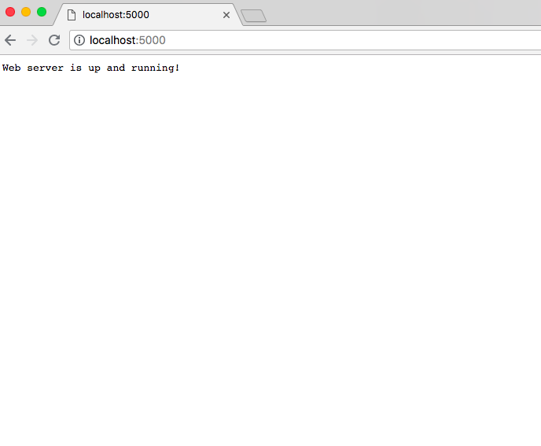

# Running background tasks in Python using task queues

Any compute-intensive time-taking task whose execution is not feasible in the same process where the request for the task is received can be called a _background task_. One such example is of post-order processing on e-commerce platforms which may consist of tasks like sending a confirmation of the order to the buyer through messaging service or doing some data analysis. These tasks cannot be executed on the same process where the order is placed as it may take considerable time to complete a single order. This calls for an asynchronous strategy which uses queues for maintaining a list of background tasks to be executed. 

_Workers_ can be used to execute these tasks in the background. They run concurrently in the background along with the main process and executes the tasks present in queues chronologically. This modular approach prevents the web server or the main process from being blocked from responding to incoming client requests.


Task or message queues are quite popular among microservices architecture. They enable each microservice to perform its dedicated task and work as a medium for inter-microservice communication. These queues store messages or data incoming from _producer_ microservices which can be processed or consumed by _consumer_ microservices. In the introductory e-commerce example above, the REST API handling orders is a producer microservice which pushes these orders to the queue. Whereas, a data analysis microservice or the messaging service can be considered a consumer microservice.

## Real World Application

We will be writing a flask-based web application which retrieves _Goodreads_ book information like title, author, rating and description. The web server exposes an endpoint that accepts book URLs. A function will crawl and parse this URL  for meta information of the book. As this function will take time to execute and may lead to blocking of the main thread, we will execute it asynchronously by pushing it to Redis queue (RQ).

RQ allows us to enqueue multiple function calls to a queue which can be executed parallelly by a separate worker process. It requires Redis server as a message broker for performing this operation. Let's get into the code and learn how we can use Redis queue in our web applications.

For bootstrapping the development and avoiding the hassles of setting up the project from scratch, you can use the starter repo here to follow along. This starter application requires Docker to be installed on your machine. To do so, you can head out [here](https://www.docker.com/community-edition) and install the relevant version depending upon your environment.

### Setup the starter application

First, clone the repository by running the following command in a terminal:

```
git clone https://github.com/divyanshutomar/flask-task-queue.git
```

To check if everything is working fine, start Docker daemon and run `docker-compose up --build` to start the application. This launches two containers, our web server application and Redis server interlinked with each other using Docker networking. The `--build` argument makes sure the image is built using the latest code every time while running the containers. Visit `localhost:5000` in a browser to check if web service is working fine. This is the default URL that Gunicorn runs our flask application on.




### Getting to Know Starter Application

The starter application uses python based web framework called `Flask`. It will be used for exposing the REST API endpoints. The flask application is served using the `Gunicorn` HTTP server. We use `honcho` to start our web application as it allows us to run multiple processes at the startup. It uses Procfile for specifying the processes that need to be run. Currently, only Gunicorn is started using honcho.


`Pipenv` is used for managing the python dependencies and environment. We use `Docker` for containerising and running our application in an isolated environment. Dockerfile lets us specify how our application should be run. Docker compose lets us orchestrate multiple containers (flask web server and Redis server in our case) to run together and be able to communicate with each other.

### Writing the parser

Let's start with writing a simple parser that accepts a Goodreads book page URL. We will be using requests python library for making an HTTP request to get HTML content of the page. BeautifulSoup is a python library that lets us search, manipulate and create structured markup languages such as HTML, XML, etc. This will allow us to retrieve key information like the book title, author, rating, and description.

```python
# server.py

def parse_book_link_for_meta_data(bookLink):
  htmlString = requests.get(bookLink).content # Fetch HTML string of the book information page
  bsTree = BeautifulSoup(htmlString,"html.parser") # Build a searchable tree using fetched HTML
  # Find the required book attributes in the tree
  title = bsTree.find("h1", attrs={"id": "bookTitle"}).string
  author = bsTree.find("a", attrs={"class": "authorName"}).span.string
  rating = bsTree.find("span", attrs={"itemprop": "ratingValue"}).string
  description = ''.join(bsTree.find("div", attrs={"id": "description"}).find("span", attrs={"style": "display:none"}).stripped_strings)
  return dict(title=title.strip() if title else '',author=author.strip() if author else '',rating=float(rating.strip() if rating else 0),description=description)
```

We can now write a function called `parse_and_persist_book_info` that calls the above parsing function and persists the value to Redis so that it can be retrieved later. This function along with its arguments will be pushed to queue so that the worker process can execute it.

Redis is a key-value store where the key should be unique else it may lead to overwriting of a previous value. Here `generate_redis_key_for_book` is a function that generates a unique key for a given book URL.

```python
# server.py
import pickle

# Spawn a client connection to redis server. Here Docker
# provieds a link to our local redis server usinf 'redis'
redisClient = Redis(host='redis')

#........
#........

# This generates a unique Redis key against a book URL
# Eg: For URL "https://www.goodreads.com/book/show/6519813-the-private-papers-of-eastern-jewel" , this lambda function
# will return the key as "GOODREADS_BOOKS_INFO:https://www.goodreads.com/book/show/6519813-the-private-papers-of-eastern-jewel"
generate_redis_key_for_book = lambda bookURL: 'GOODREADS_BOOKS_INFO:' + bookURL

def parse_and_persist_book_info(bookUrl):
  redisKey = generate_redis_key_for_book(bookUrl) # get Redis key for given book URL
  # get book meta information from parsing function above. The function
  # returns a python dictionary.
  bookInfo  = parse_book_link_for_meta_data(bookUrl) 
  # Here pickle module is used to serialize python objects.
  # We use pickle.dumps method to convert the dictionary into a byte stream
  # which can be stored as a value in Redis against the key generated above
  redisClient.set(redisKey,pickle.dumps(bookInfo))
```

### The endpoint for accepting URLs

For validating the Goodreads book URLs we check for unique occurrences of URLs which starts with the string `https://www.goodreads.com/book/show/`. After the validation check, all valid URLs are pushed to Redis queue for parsing information. Here the method `enqueue_call` of Redis queue instance takes in a function that will be executed by worker process along with required arguments of the function.

```python
# server.py

from rq import Queue
# Make an instance of Redis Queue with connection to Redis server
bookInfoParserQueue = Queue('bookInfoParser',connection=redisClient)


# Endpoint that accepts an array of Goodreads URLs for meta information parsing
@app.route('/parseGoodreadsLinks', methods=["POST"])
def parse_goodreads_urls():
  bodyJSON = request.get_json() # Get JSON body from POST request
  if (isinstance(bodyJSON,list) and len(bodyJSON)): # Check whether JSON is list or not
    bookLinksArray = [x for x in list(set(bodyJSON)) if x.startswith('https://www.goodreads.com/book/show/')] #validation check for goodreads book URL
    if (len(bookLinksArray)):
      for bookUrl in bookLinksArray:
        bookInfoParserQueue.enqueue_call(func=parse_and_persist_book_info,args=(bookUrl,),job_id=bookUrl) # enqueue to Redis queue
      return "%d books are scheduled for info parsing."%(len(bookLinksArray))
  return "Only array of goodreads book links is accepted.",400
```
Here the returned response specifies the number of jobs (parsing of book information in this case) scheduled.

### The endpoint for retrieving book information

An endpoint that will accept a query parameter `url` with a value of a book URL. It will request the Redis server for book information corresponding to the URL received from the request. If the key is set and book information is found, return a JSON response containing book information.

```python
# server.py

# Endpoint for retrieving book info from Redis
@app.route('/getBookInfo', methods=["GET"])
def get_goodreads_book_info():
  bookURL = request.args.get('url', None) # retrieve query parameter
  if (bookURL and bookURL.startswith('https://www.goodreads.com/book/show/')): # validation check for goodreads book URL
    redisKey = generate_redis_key_for_book(bookURL) # generate Redis key for given book URL
    cachedValue = redisClient.get(redisKey) # Fetch value for the given Redis key
    if cachedValue: # Check whether value is present
      return jsonify(pickle.loads(cachedValue)) # return book information in JSON format
    return "No meta info found for this book."
  return "'url' query parameter is required. It must be a valid goodreads book URL.",400
```

### Inspecting task queue

`rq-dashboard` is a library for checking the state of Redis queue. The dashboard provides a very intuitive interface for visualising the queue in realtime as tasks are scheduled and executed by a worker process. It provides triggers for flushing the queue and re-queuing failed jobs.  In case of a task failure, it prints out the error trace. `rq-dashboard` can be easily integrated with an existing flask project through blueprint exposed by the library.


Let's integrate it with our application.

```python
# server.py
import rq_dashboard

#......
#......

app.config.from_object(rq_dashboard.default_settings) # set default settings for rq-dashboard
app.config.update(REDIS_URL='redis://redis') # Set URL of Redis server being used by Redis Queue
app.register_blueprint(rq_dashboard.blueprint, url_prefix="/rqstatus") # Register flask blueprint with prefix /rqstatus
```

### Testing the application

Now, we are all set to begin testing our application with some Goodreads URLs. We will be using [Postman](https://www.getpostman.com/) for making the API requests. Let's start by making a POST request to `/parseGoodReads` endpoint. Make sure to provide a valid list of URLs in an array as the request body.


We can check for the tasks scheduled by navigating to rq dashboard endpoint `/rqstatus`.


Once the queue becomes empty and all tasks are executed successfully, we can check for the meta information. To do so, make a GET request to `/getBookInfo` endpoint with an URL query parameter having the value set as one of the URLs from previous POST request. This returns a JSON response containing information like title, author, rating and description.


You can view the full code [here](https://github.com/divyanshutomar/flask-task-queue/tree/completed).

## Conclusion and Takeaways

The above application demonstrates how queuing frameworks like Redis Queue can be leveraged for solving problems which demands an asynchronous approach. This also brings modularity to the table, making it possible to extend the functionality of your service later on.


Following are some of the key takeaways you can follow to tackle similar problems:
* Queueing frameworks allow more granular control over scaling of different processes. More worker processes can be spawned if there is an accumulation of a large number of tasks in the queue.
* Multiple queues can be used for handling different type of tasks.
* Every task can send some meta information about its status or progress so far to Redis. This information can be useful for getting an insight into a task that runs for a long duration.

## Other Frameworks

Here are a couple other task-queing frameworks if you're not interested in using Redis Queues.

### [Celery](http://www.celeryproject.org/)

This is undoubtedly one of the most popular tasks queuing frameworks in Python. It has a wide community support and it is recommended for high-velocity production applications. It offers both asynchronous and synchronous mode with support of multiple worker processes. RabbitMQ, Redis, Beanstalk are some of the message brokers supported.

### [AWS SQS](https://aws.amazon.com/sqs/)

Amazon Web Services (AWS) provides a fully managed queuing service called Simple Queueing Service. It can be readily used with any existing application without the need for deploying or managing the queuing service. AWS provides SDKs for many popular languages making it a language agnostic solution. It has recently got the support of AWS lambda functions which makes it suitable for a serverless architecture. Now a lambda function can execute the tasks present in SQS, acting as a worker.

There are many other queueing frameworks or services available. Refer [queues.io](http://queues.io/) to discover more.
