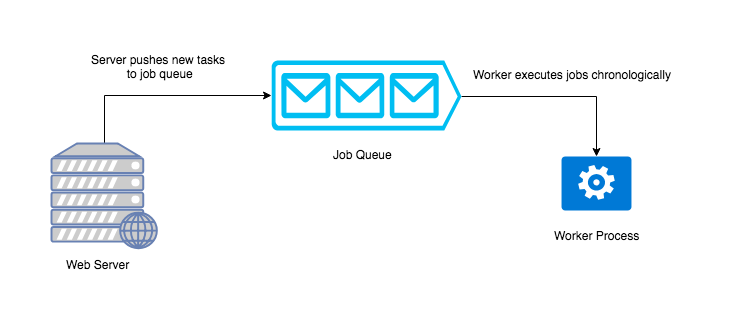
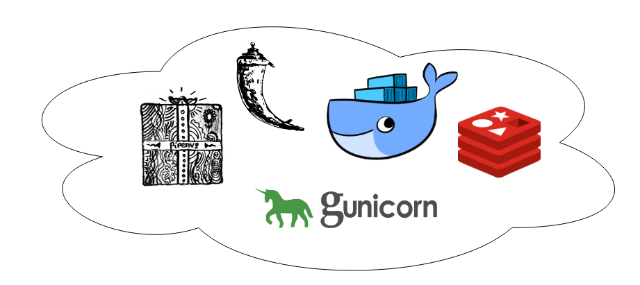
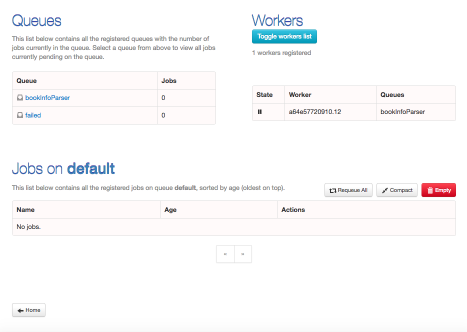
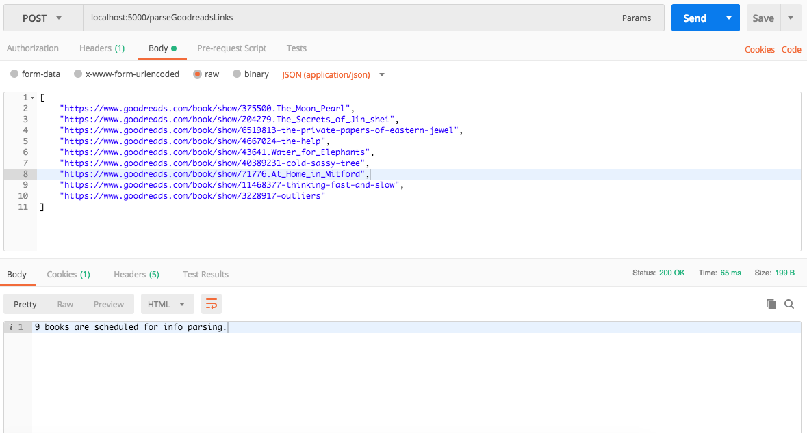
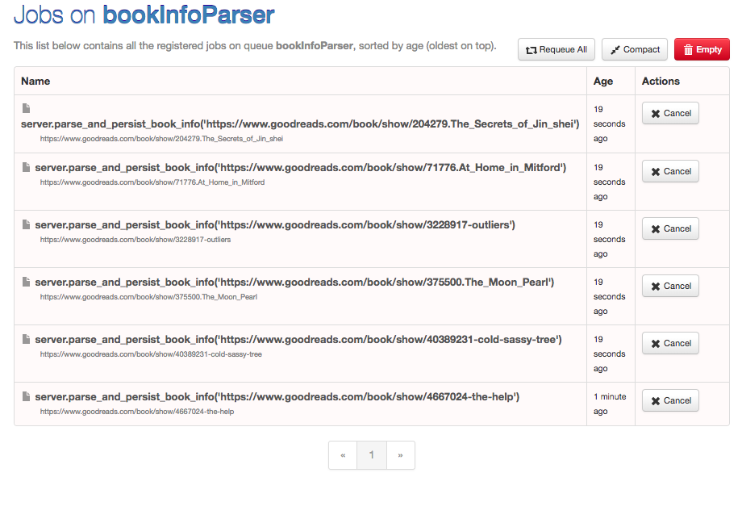
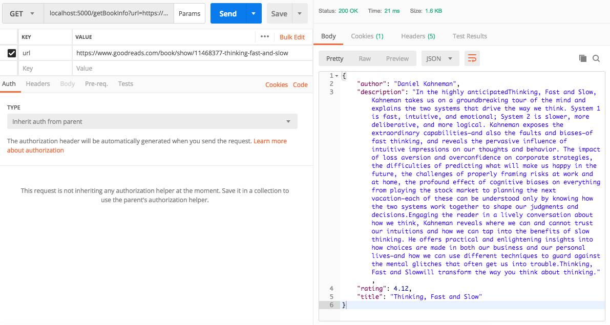

# Running background tasks in Python using task queues

By nature, Python is a linear language. It's often not feasible to execute a process when the request is received (especially when dealing with I/O) to prevent the thread from blocking incoming client requests. This requires an asynchronous strategy which uses queues to maintain a list of background tasks.

_Workers_ can be used to execute these tasks in the background. They run concurrently with the main process and execute the tasks present in the queue chronologically. This modular approach prevents the main process from becoming blocked.



Task queues are popular among microservice architectures because they enable each microservice to perform its dedicated task and they work as a medium for inter-microservice communication. These queues store messages or data incoming from _producer_ microservices which can be processed by _consumer_ microservices. 

_This is a guest post brought to you by your friends @ Timber. Though our product doesn't have anything to do with task queues, we're a company that is trying to reinvent logging. You should [check us out](https://timber.io/)._

## Real World Application

We will be writing a flask-based web application which retrieves _Goodreads_ book information like title, author, rating, and description. We'll write a function to crawl and parse the URL for the book's meta information. Since the function will take time to execute, we'll execute it asynchronously using Redis Queues (RQ) to prevent it from blocking the main thread.

Redis Queue's allow you to enqueue function calls which can be executed in parallel by separate worker processes. They require a Redis server as a message broker to perform this operation. 

You can use the starter repo here to follow along. It requires Docker to be installed on your machine. you can head out [here](https://www.docker.com/community-edition) and install the relevant version.

### Setup the starter application

First, clone the repository by running the following command:

```
git clone https://github.com/divyanshutomar/flask-task-queue.git
```

Start the Docker daemon and run `docker-compose up --build` to start the application. This launches two containers, the web server application and Redis server interlinked using Docker networking. The `--build` argument ensures the image is built using the latest code every time. Visit `localhost:5000` in a browser to make sure the web service is working.



### Writing the parser

We'll use the requests library to make an HTTP request to GoodReads. BeautifulSoup allows us to search, manipulate and create structured markup languages to retrieve critical information such as the title, author, rating, and description.

```python
# server.py

def parse_book_link_for_meta_data(bookLink):
  htmlString = requests.get(bookLink).content # Fetch HTML string of the book information page
  bsTree = BeautifulSoup(htmlString,"html.parser") # Build a searchable tree using fetched HTML
  # Find the required book attributes in the tree
  title = bsTree.find("h1", attrs={"id": "bookTitle"}).string
  author = bsTree.find("a", attrs={"class": "authorName"}).span.string
  rating = bsTree.find("span", attrs={"itemprop": "ratingValue"}).string
  description = ''.join(bsTree.find("div", attrs={"id": "description"}).find("span", attrs={"style": "display:none"}).stripped_strings)
  return dict(title=title.strip() if title else '',author=author.strip() if author else '',rating=float(rating.strip() if rating else 0),description=description)
```

Now we can write a function called `parse_and_persist_book_info` to parse the above function and enqueue the value to the RQ for the worker processes.

`generate_redis_key_for_book` generates a unique key for a given book URL, since Redis is a key-value store that requires each key is unique.

```python
# server.py
import pickle

# Spawn a client connection to redis server. Here Docker
# provides a link to our local redis server using 'redis'
redisClient = Redis(host='redis')

#........
#........

# This generates a unique Redis key against a book URL
# Eg: For URL "https://www.goodreads.com/book/show/6519813-the-private-papers-of-eastern-jewel" , this lambda function
# will return the key as "GOODREADS_BOOKS_INFO:https://www.goodreads.com/book/show/6519813-the-private-papers-of-eastern-jewel"
generate_redis_key_for_book = lambda bookURL: 'GOODREADS_BOOKS_INFO:' + bookURL

def parse_and_persist_book_info(bookUrl):
  redisKey = generate_redis_key_for_book(bookUrl) # get Redis key for given book URL
  # get book meta information from parsing function above. The function
  # returns a python dictionary.
  bookInfo  = parse_book_link_for_meta_data(bookUrl) 
  # Here pickle module is used to serialize python objects.
  # We use pickle.dumps method to convert the dictionary into a byte stream
  # which can be stored as a value in Redis against the key generated above
  redisClient.set(redisKey,pickle.dumps(bookInfo))
```

### The endpoint for accepting URLs

After validating the GoodReads URL, they are pushed to the RQ to parse the information. Here the method `enqueue_call` takes in a function that will be executed by a worker process.

```python
# server.py

from rq import Queue
# Make an instance of Redis Queue with connection to Redis server
bookInfoParserQueue = Queue('bookInfoParser',connection=redisClient)


# Endpoint that accepts an array of Goodreads URLs for meta information parsing
@app.route('/parseGoodreadsLinks', methods=["POST"])
def parse_goodreads_urls():
  bodyJSON = request.get_json() # Get JSON body from POST request
  if (isinstance(bodyJSON,list) and len(bodyJSON)): # Check whether JSON is list or not
    bookLinksArray = [x for x in list(set(bodyJSON)) if x.startswith('https://www.goodreads.com/book/show/')] #validation check for goodreads book URL
    if (len(bookLinksArray)):
      for bookUrl in bookLinksArray:
        bookInfoParserQueue.enqueue_call(func=parse_and_persist_book_info,args=(bookUrl,),job_id=bookUrl) # enqueue to Redis queue
      return "%d books are scheduled for info parsing."%(len(bookLinksArray))
  return "Only array of goodreads book links is accepted.",400
```
The returned response specifies the number of jobs scheduled.

### The endpoint for retrieving book information

We need to open an endpoint that will accept a `url` and request the Redis Server for the book information. 

```python
# server.py

# Endpoint for retrieving book info from Redis
@app.route('/getBookInfo', methods=["GET"])
def get_goodreads_book_info():
  bookURL = request.args.get('url', None) # retrieve query parameter
  if (bookURL and bookURL.startswith('https://www.goodreads.com/book/show/')): # validation check for goodreads book URL
    redisKey = generate_redis_key_for_book(bookURL) # generate Redis key for given book URL
    cachedValue = redisClient.get(redisKey) # Fetch value for the given Redis key
    if cachedValue: # Check whether value is present
      return jsonify(pickle.loads(cachedValue)) # return book information in JSON format
    return "No meta info found for this book."
  return "'url' query parameter is required. It must be a valid goodreads book URL.",400
```

### Inspecting task queue

`rq-dashboard` can be used to check the state of Redis queue. The dashboard provides an intuitive interface for visualizing the queue in real-time as tasks are scheduled and executed. It provides triggers to flush the queue and re-queue failed jobs.  In case of a task failure, it prints out the error trace. 



Let's integrate it with our application.

```python
# server.py
import rq_dashboard

#......
#......

app.config.from_object(rq_dashboard.default_settings) # set default settings for rq-dashboard
app.config.update(REDIS_URL='redis://redis') # Set URL of Redis server being used by Redis Queue
app.register_blueprint(rq_dashboard.blueprint, url_prefix="/rqstatus") # Register flask blueprint with prefix /rqstatus
```

### Testing the application

Now, all we need to do is test the application. We can do this using [Postman](https://www.getpostman.com/) to make the API request. Let's start by making a POST request to `/parseGoodReads` endpoint. Make sure to provide a valid list of URLs in an array.



We can check for the tasks scheduled by navigating to the rq dashboard endpoint `/rqstatus`.



Once the queue empties and all tasks are executed successfully, we can check for the meta information. Make a GET request to `/getBookInfo` endpoint with a URL from the POST request, and you should receive a JSON object containing the title, author, rating, and description.



You can view the full code [here](https://github.com/divyanshutomar/flask-task-queue/tree/completed).

## Conclusion and Takeaways

The above application demonstrates Redis Queues can be leveraged to approach problems asynchronously. Since concurrency isn't native to Python, it's important to understand both when it's necessary and how to use it. If you want to learn [the difference between multiprocessing and threading](https://timber.io/blog/multiprocessing-vs-multithreading-in-python-what-you-need-to-know/), it's one of our most popular guides. 


Following are some of the key takeaways you can follow to tackle similar problems:
* Queueing frameworks provide a granular control over scaling because worker processes can be spawned if there is an accumulation of tasks in the queue.
* Multiple queues can be used to handle different type of tasks.
* Tasks can send information on their status to Redis, bringing insight into the task.

## Other Frameworks

Though powerful, Redis Queues aren't the only task-queueing framework.

### [Celery](http://www.celeryproject.org/)

This is one of the most popular tasks queuing frameworks in Python. It has wide community support and is recommended for high-velocity production applications. It offers both asynchronous and synchronous mode with support of multiple worker processes. RabbitMQ, Redis, Beanstalk are some of the message brokers supported.

### [AWS SQS](https://aws.amazon.com/sqs/)

Amazon Web Services (AWS) provides a fully managed queuing service called Simple Queueing Service. It can be readily used with any existing application without the need to deploy or manage the service. AWS provides SDKs for popular languages making it a language agnostic solution. They've recently started supporting AWS Lambda, making it suitable for a serverless architecture. 

There are many other queueing frameworks or services available. Refer [queues.io](http://queues.io/) to discover more.
